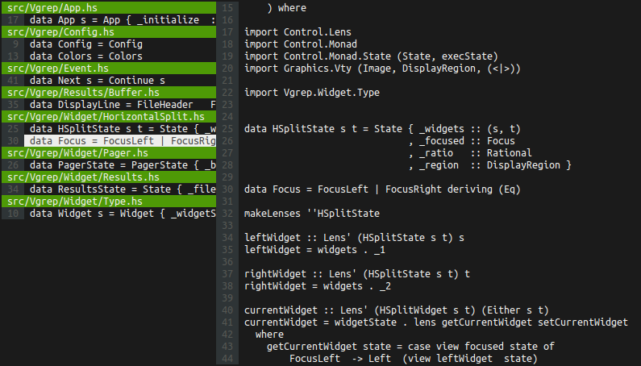

`vgrep` -- A pager for `grep`
=============================



## Usage

* As a pager:
```bash
grep -rn data /some/path | vgrep  # -n for line numbers
```

* As a drop-in replacement for `grep`:
```bash
vgrep data /some/path                  # recursive by default
vgrep data /some/path | vgrep default  # works with pipes, too
```

## Installation

### Binaries

Debian/Ubuntu: `.deb` files are available for the [latest release][1].

```bash
wget https://github.com/fmthoma/vgrep/releases/download/v0.1.4.1/vgrep_0.1.4.1-1_amd64.deb
sudo dpkg -i vgrep_0.1.4.1-1_amd64.deb
```

### From [Hackage][2]

Installation from Hackage via [`stack`][3] is recommended:
```bash
stack update
stack install vgrep
```
This will install `vgrep` to your `~/.local/bin` directory.

### From source

```bash
git clone https://github.com/fmthoma/vgrep.git
cd vgrep
stack setup
stack install
```

[1]: https://github.com/fmthoma/vgrep/releases/latest
[2]: https://hackage.haskell.org/packages/vgrep
[3]: https://github.com/commercialhaskell/stack/blob/master/doc/install_and_upgrade.md
